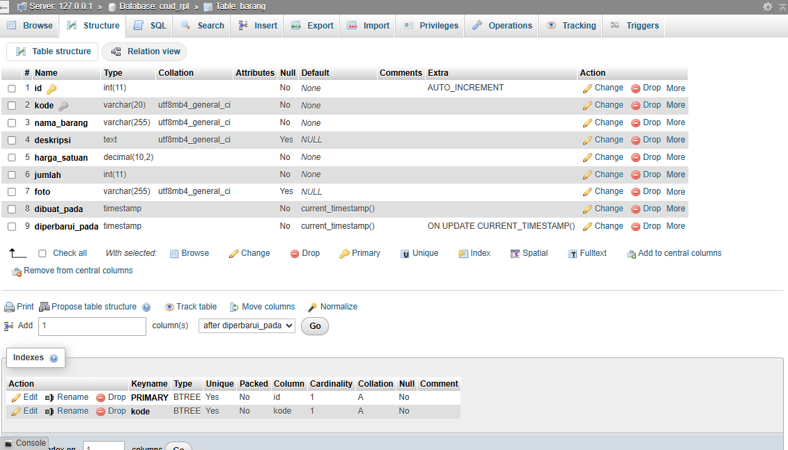
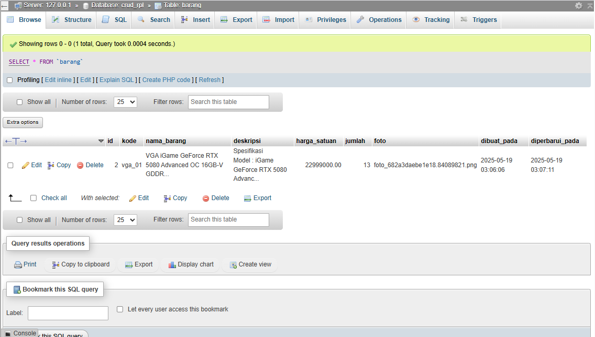

# Aplikasi CRUD Stok Barang - PHP Native

Aplikasi web sederhana untuk mengelola data stok barang (Create, Read, Update, Delete) menggunakan PHP Native, MySQL, dan Bootstrap 5. 
Proyek ini dibuat untuk memenuhi tugas mata kuliah Rekayasa Perangkat Lunak.

## Fitur Utama
- Tambah Data Barang Baru
- Lihat Daftar Semua Barang
- Edit Data Barang yang Sudah Ada
- Hapus Data Barang
- Upload Foto Barang
- Tampilan Responsif dengan Bootstrap 5
- Pesan status untuk setiap operasi CRUD

## Teknologi yang Digunakan
- PHP (Native)
- MySQL (MariaDB via XAMPP)
- Bootstrap 5 (via CDN)
- HTML5
- CSS3 (Kustom)

## Prasyarat
- Web Server (Apache, bagian dari XAMPP)
- PHP (versi 7.4 atau lebih baru)
- MySQL atau MariaDB

## Cara Instalasi dan Setup Lokal
1.  **Clone Repository (atau Unduh ZIP):**
    ```bash
    git clone [https://github.com/Fawrz/crud-php-native.git](https://github.com/Fawrz/crud-php-native.git)
    ```
    Atau unduh ZIP dan ekstrak ke direktori web server (misalnya, `C:\xampp\htdocs\` jika menggunakan XAMPP). Ubah nama folder hasil ekstrak menjadi `crud-native` jika perlu.

2.  **Buat Database:**
    * Buka phpMyAdmin (biasanya `http://localhost/phpmyadmin`).
    * Buat database baru dengan nama: `crud_rpl` (sesuaikan dengan penamaan database).

3.  **Impor Struktur Tabel:**
    Jalankan query SQL berikut di database `crud_rpl` (melalui tab SQL di phpMyAdmin) untuk membuat tabel `barang`:
    ```sql
    CREATE TABLE barang (
        id INT AUTO_INCREMENT PRIMARY KEY,
        kode VARCHAR(20) UNIQUE NOT NULL,
        nama_barang VARCHAR(255) NOT NULL,
        deskripsi TEXT NULL,
        harga_satuan DECIMAL(10, 2) NOT NULL,
        jumlah INT NOT NULL,
        foto VARCHAR(255) NULL,
        dibuat_pada TIMESTAMP DEFAULT CURRENT_TIMESTAMP,
        diperbarui_pada TIMESTAMP DEFAULT CURRENT_TIMESTAMP ON UPDATE CURRENT_TIMESTAMP
    );
    ```

4.  **Konfigurasi Database (jika perlu):**
    File konfigurasi database ada di `config/database.php`. Secara default, sudah diatur untuk XAMPP standar (host: `localhost`, user: `root`, password: ``, dbname: `crud_rpl`). Sesuaikan dengan konfigurasi XAMPP yang digunakan.

5.  **Buat Folder `uploads/`:**
    Di dalam direktori root proyek (`crud-native/`), pastikan ada folder bernama `uploads/`. Folder ini digunakan untuk menyimpan gambar produk yang diunggah.

6.  **Akses Aplikasi:**
    Buka browser kemudian navigasi ke `http://localhost/crud-native/` (atau path yang sesuai jika meletakkannya di subfolder lain di `htdocs`).

## Tampilan Aplikasi (Screenshot)

Berikut adalah beberapa tangkapan layar dari aplikasi:

**1. Halaman Utama (Daftar Barang):**
 

**2. Form Tambah Barang:**


**3. Form Edit Barang:**


## Tampilan Database phpMyAdmin

Berikut adalah beberapa tangkapan layar dari Database phpMyAdmin:

**1. Struktur Tabel Barang:**
 

**2. Database Tabel Barang:**


---
*Dibuat oleh: Muhammad Rifat Fawaz*
*NIM: 24091397039*
*Mata Kuliah: Rekayasa Perangkat Lunak*
```